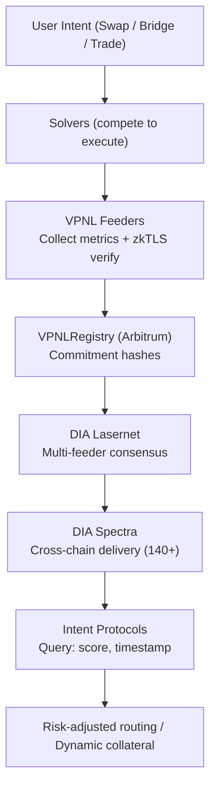

<p align="center">
  
</p>

<h2 align="center">VPNL: The Verifiable Performance Network Layer</h2>

<p align="center">
  <em>Open reputation standards for provable performance across on-chain systems.</em><br>
</p>

---

## 🧭 Overview

**VPNL** is an open-source protocol for **verifiable performance and reputation proofs**.  
It enables traders, solvers, and liquidity providers to demonstrate their track records through cryptographically verifiable, privacy-preserving credentials.

VPNL serves as the **reputation and performance layer for the Open Intents Framework (OIF)** — and any protocol needing trustless, cross-chain reputation data.

---

## ⚙️ Architecture

| Layer | Description |
|-------|--------------|
| **Registry Contracts** | On-chain verification registry (Ethereum / Arbitrum Sepolia) |
| **Schema Definitions** | JSON-based performance and reputation formats |
| **Oracle Integration** | Data ingestion + DIA Lumina oracle feeds |
| **SDK + Scripts** | Developer tools for deployment and testing |
| **Test Data** | Sample solver and trader performance records |

**Goal:**  
Create a modular, composable infrastructure for measuring *verifiable performance* — and making it portable across DeFi, AI, and coordination systems.

---

## 🚀 Quickstart

### 1. Install Dependencies
```bash
pnpm install
# or
npm install
```

### 2. Compile Contracts
```bash
npx hardhat compile
```

### 3. Deploy Locally
```bash
npx hardhat run scripts/deploy.js --network localhost
```

### 4. Populate Example Data
```bash
node scripts/populate-testdata.js
```

### 5. Run Tests
```bash
npx hardhat test
```

---

## 🧩 Project Structure

```
vpnl/
├── contracts/               # Core smart contracts
│   └── VPNLRegistry.sol
├── deployments/             # Network deployment records
├── schemas/                 # JSON schema for performance + reputation
├── scripts/                 # Deployment + verification scripts
├── test/                    # Unit tests
├── docs/                    # Architecture and design docs
└── demo/                    # Frontend and assets
```

---

## 🔐 Security & Licensing

- **License:** [MIT](LICENSE)  
- **Security Policy:** [SECURITY.md](SECURITY.md)  
- **Contributing:** [CONTRIBUTING.md](CONTRIBUTING.md)

We believe transparency is the foundation of verifiable trust.  
All code, tests, and documentation are open for public review and contribution.

---

## 🌐 Integrations

| Partner | Purpose |
|----------|----------|
| **DIA Lumina** | Decentralized oracle layer for performance data (in development) |
| **Open Intents Framework (OIF)** | Routing layer for solver reputation |
| **Uniswap v4** | Hook-based liquidity provider verification (in progress) |
| **HyperPNL** | Trader verification data source (prospective) |

---

## 💬 Community

- Discussions: [GitHub Issues](https://github.com/vpnlnetwork/vpnl/issues)  
- Twitter / Updates: [@vpnlnetwork](https://twitter.com/vpnlnetwork)  
- Documentation: [vpnl.io](https://vpnl.io)

---

<p align="center">
  <sub>Part of the Skyless open R&D ecosystem — building transparent, verifiable, and privacy-preserving trust infrastructure for the next internet.</sub>
</p>

## VPNL & the Open Intents Framework

[](LICENSE)
[]()
[]()
[]()

---

## Deployed Address

| Network | Contract | Address | Explorer | Date |
|----------|-----------|--------|----------|------|
| **Arbitrum Sepolia** | VPNLRegistry | [`0xD3Acf580A28977D24da7d20364A2F557606d439A`](https://sepolia.arbiscan.io/address/0xD3Acf580A28977D24da7d20364A2F557606d439A) | [Demo Explorer](https://e6162db1-34bf-4ac3-8737-d269bcf54999-00-1reolrpr7gf4l.riker.replit.dev) | Oct 2025 |

> 📡 **Status:** Testnet operational — 4 verifications seeded  
> 🧪 **Next:** Security audit → Mainnet deployment

---

## Live Testnet Demo

**Try it now:** [VPNL Demo on Arbitrum Sepolia](https://e6162db1-34bf-4ac3-8737-d269bcf54999-00-1reolrpr7gf4l.riker.replit.dev)

Explore the deployed registry with a block-explorer style UI:
- View verified solver reputations
- Query any address for verification status
- See reputation scores and tiers in action

**Contract:** [View on Arbiscan](https://sepolia.arbiscan.io/address/0xD3Acf580A28977D24da7d20364A2F557606d439A)

---

## Overview

**VPNL** provides open data schemas that enable **risk-adjusted routing** for intent-based protocols.  
We’re building **W3C Verifiable Credential** standards and an **on-chain registry** so protocols can verify solver performance **without centralized allowlists**.

**Infrastructure Partner:** integrating with **[DIA Lumina](https://www.diadata.org/lumina/)**, an on-chain oracle network, for decentralized verification and cross-chain delivery.

---

## The Problem

Without open, portable performance data, the Open Intents Framework (OIF) hits a trilemma:

- ❌ **Centralized allowlists** (defeats permissionlessness)  
- ❌ **Massive overcollateralization** (kills capital efficiency)  
- ❌ **Unacceptable risk exposure** (endangers users)

---

## The Solution

**VPNL** resolves this by providing:

- 🧩 **Open Data Schema:** W3C VC-compatible reputation credentials  
- 🔗 **On-Chain Registry:** Cryptographic commitments (**zero PII**) on Arbitrum (+ DIA Lasernet in Phase 2)  
- ⚖️ **Risk-Adjusted Routing:** Protocols scale collateral with verified reputation  
- 🌐 **Decentralized Verification Path:** Powered by DIA Lumina’s permissionless oracle network

**Example:**

| Solver | Score | Collateral | Routing Access |
|--------|------:|-----------:|----------------|
| **Solver A** | 0.85 (Expert) | $15k | Priority |
| **Solver B** | — (Unverified) | $100k | Limited or rejected |

**Result:** ✅ Permissionless + ✅ Safe + ✅ Capital Efficient

---

## Economic Impact

**100 Solvers Without VPNL**
- All post 100% collateral  
- 100 × $100k = **$10M locked**

**100 Solvers With VPNL (Risk-Adjusted)**
- 30 experts (≥0.80): $15k each = $450k  
- 40 advanced (0.60–0.79): $50k each = $2M  
- 30 emerging (~0.30): $76k each = $2.28M  
- **Total:** $4.73M locked → **$5.27M freed** (**~53%** more efficient)  
  *Conservative real-world estimate adjusts to ~45% accounting for overhead and safety buffers.*

---
### 🔹 How VPNL Evaluates Solvers

VPNL tracks solver performance across verifiable, on-chain metrics to ensure transparent reputation scoring.

| **Metric** | **What It Measures** | **Data Source** |
|-------------|----------------------|-----------------|
| **Execution Success Rate** | How often a solver fulfills intents correctly and on time | On-chain transaction logs |
| **Capital Efficiency** | Ratio of filled vs. reserved capital, indicating optimal fund usage | Smart contract event data |
| **Latency** | Average time between intent broadcast and solver execution | Timestamp differentials across blocks |
| **Slippage / Price Quality** | Whether the solver provided the best available rate | DIA price feeds and DEX APIs |
| **Reputation Continuity** | Consistency of behavior and reliability across multiple epochs | VPNLRegistry commitment proofs |
---

## Data Flow Architecture



---

## VPNL & DIA Lumina

**Why DIA Lumina?**
- 🔓 **Permissionless:** Anyone can run feeder nodes  
- 🔐 **Crypto-Economic Security:** Staking + slashing replaces centralized trust  
- 🌐 **Cross-Chain Native:** Reputation available on ~140+ chains (Spectra)  
- ⚡ **Battle-Tested:** Production oracle infra  
- 🔬 **zkTLS Integration:** Cryptographic proof of exchange API data (Phase 2+)

**Read more:** [`docs/dia-lumina-integration.md`](docs/dia-lumina-integration.md)

---

## Key Features

- 🎯 **Performance-Focused Reputation** (not generic scores)  
- 🔓 **Open Standards** (W3C VCs, EAS-friendly attestations)  
- 🔐 **Privacy-First** (zero PII on-chain; commitments; ZK-ready)  
- 🌐 **Protocol-Agnostic, Cross-Chain** (via oracles)  
- 🏛️ **Credibly Neutral** (MIT license, progressive decentralization)

---

## Roadmap

### Phase 1 — Foundation & Security
- Third-party smart contract **security audit**
- **Arbitrum mainnet** deployment
- Public subgraph (The Graph) + open API
- 2–3 pilot protocol integrations

### Phase 2 — Decentralization (DIA Lumina)
- VPNL feeder nodes on Lasernet + zkTLS integration
- Permissionless verification, cross-chain delivery (Spectra)
- Multi-sig governance upgrade; community dispute flow

### Phase 3 — Ecosystem Growth
- Developer SDKs (TypeScript, Python) + docs
- 5–10+ protocol integrations
- Public analytics dashboard; community-run feeder nodes

**Success Metrics**
- 100+ verified solvers  
- Real-world validation of ~45% capital efficiency  
- 10+ active protocol integrations  
- Zero security incidents

---

Security posture & runbook: see **[SECURITY.md](SECURITY.md)**

---

## Quick Start

```bash
# Clone the repository
git clone https://github.com/vpnlnetwork/vpnl.git
cd vpnl

# Install dependencies
npm install

# Run smart contract tests
npx hardhat test

# Local dev network
npx hardhat node
npx hardhat run scripts/deploy.js --network localhost

# Testnet deploy (Arbitrum Sepolia)
# configure RPC + key in hardhat.config.js or via env vars
npx hardhat run scripts/deploy.js --network arbitrum-sepolia
```

---

## For Protocols: Direct Integration

**Minimal interface**
```solidity
pragma solidity ^0.8.20;
interface IVPNLRegistry {
    function isVerified(address solver) external view returns (bool);
    function getVerification(address solver) external view returns (
        bytes32 commitmentHash,
        uint256 verifiedAt,
        uint256 expiresAt,
        bool active,
        bool revoked
    );
}
```

**Example collateral policy**
```solidity
function calculateCollateral(address solver, uint256 intentValue)
  public view returns (uint256)
{
  if (!vpnlRegistry.isVerified(solver)) {
    return intentValue; // 100% for unverified
  }
  // Example: 15% for verified (policy is protocol-defined)
  return intentValue * 15 / 100;
}
```

> **Phase 2:** fine-grained scores via DIA Oracle key (e.g., `VPNL/<solver>`).  
> SDKs will simplify this flow.

---

## Technical Specs

**Smart Contracts**
- Chain: Arbitrum (primary) + DIA Lasernet (Phase 2+)  
- Language: Solidity 0.8.x  
- Standards: EAS attestations, W3C VCs, DIA Oracle integration

**Verification Schemas**
- Format: W3C Verifiable Credentials 2.0  
- Signature: ECDSA (secp256k1)  
- Commitment: `keccak256(score || salt || context)`

**API (planned)**
- Endpoint: `api.vpnl.network`  
- Methods: `GET /reputation/{address}`, `POST /verify`  
- Auth: Public read, authenticated write

**DIA Integration (planned)**
- Feeder nodes: modified decentral-feeder  
- Storage: DIA Lasernet (Arbitrum Orbit L2)  
- Cross-chain: DIA Spectra (~140+ chains)

---

## Current Status

✅ Prototype architecture complete  
✅ Arbitrum Sepolia deployment + public demo  
✅ DIA Lumina integration path established  
🚧 Next milestone: audit → mainnet → subgraph/API  

---

## Contributing

VPNL is open source and welcomes contributions — see **[CONTRIBUTING.md](CONTRIBUTING.md)**.

---

## Resources

- 🌐 Website: [vpnl.io](https://vpnl.io)  
- 📦 GitHub: [github.com/vpnlnetwork/vpnl](https://github.com/vpnlnetwork/vpnl)  
- 📚 Docs: `docs/` (architecture, DIA, economic proof, whitepaper)  
- 💬 Telegram: [t.me/vpnlnetwork](https://t.me/vpnlnetwork)  
- 🔗 DIA Lumina: [diadata.org/lumina](https://www.diadata.org/lumina/)

---

## Public Goods Alignment

🌍 VPNL participates in the **[Gitcoin GG24: Data Interop, Infrastructure & Analytics Round](https://giveth.io/project/vpnl:-the-verifiable-performance-network-layer)** — reinforcing its mission to build verifiable, interoperable reputation infrastructure as a shared public good.

---

## Acknowledgments

**Infrastructure Partners:**
* [DIA (Decentralized Information Asset)](https://www.diadata.org/) - Trustless oracle infrastructure

**Built for the Open Intents Framework ecosystem:**
* [Ethereum Foundation](https://ethereum.foundation)
* [Hyperlane](https://hyperlane.xyz)
* [LI.FI](https://li.fi)
* [OpenZeppelin](https://www.openzeppelin.com)
* [Across Protocol](https://across.to)
* [Everclear](https://everclear.network)
* [Nomial](https://nomial.xyz)

---

## License

This project is licensed under the **MIT License** — see [LICENSE](LICENSE).

---

**VPNL:** Open standards for solver reputation.  
Enabling permissionless, risk-aware intent routing at scale.

Built for Ethereum and designed for an open, multi-chain future. 💙
